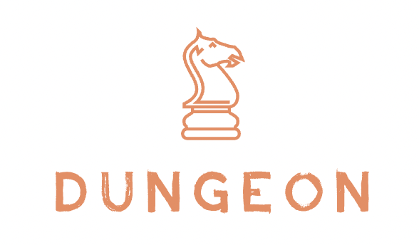

# About the Project

<div align="center">
    
</div>

The project is a dungeon simulation software. A dungeon consists of two types of location - Cave and Tunnel. A player is placed in one of these locations (the starting position) and the aim of the game is for the player to reach the ending position. But there is a twist, a cave can ocassionally house a smelly monster called an Otyugh which can eat the player. The player is equipped with arrows to shoot the Otyugh in order to injure or kill it. The aim of the game is for the player to reach the end position from the start position without getting killed by an Otyugh. Each cave can also contain treasure(s) and arrow(s), which the player can pick on its way to the goal or end position. The extra arrows help the player slay monsters on its way. The final score of the player is based on the number and types of treasures collected in the path. The player wins if it successfully reaches the end position or loses if it gets eaten by an Otyugh. Do you think the game ends here, well you are wrong.

The game now has a new monster - Yugoloth which roams around the dungeon and if encountered will beat you to death, unless you overpower it. Did I mention there are pits now in the dungeon where you can fall into an endless abyss of darkness and die. And the final touch - the notorius theif who will steal all your treasures if you encounter him.

# List of features

- Generate random mazes of different sizes.
- Generate wrapping and non-wrapping mazes.
- Generate players to be placed in the dungeon.
- Place treasures randomly in caves.
- Allow palyers to traverse the maze.
- Allow players to pick up treasures.
- Provide description of state to the player to make a move.
- Allow player to interact with various moves using keyboard.
- Place Otyughs randomly in the caves.
- Allow players to pick up arrows.
- Allow players to shoot Otyughs to injure or kill them.
- Interactive GUI version of your favourite game.
- Generate pit randomly in the maze.
- Add theif in the maze.
- Add a new monster - Yugoloth, this roams in the maze and beats you to death unless you overpower it.

# How to run

The project comes with a jar which can be used to run the program.

Considering you are in the main project folder, you need to run the following to run the jar, this will start the CLI version of the game which you have fallen in love with:-

```bash
user@programmer~:$ java -jar res/project-5.jar <numRows> <numCols> <interconnectivity> <Wrapping(W)/Non-wrapping(N)> <percentCavesWithTreasure> <force interconnectivity (Y/N)> <numberOfOtyughs>
```

There are various command line arguments to be passed, the placeholders used in the above command mean the following:

1. ```<numRows>``` - Number of rows in the maze.
2. ```<numCols>``` - Number of columns in the maze.
3. ```<interconnectivity>``` - The interconnectivity of the maze.
4. ```<Wrapping(W)/Non-wrapping(N)>``` - Whether the maze is wrapping or non-wrapping.
5. ```<percentCavesWithTreasure>``` - The percentage of caves that will contain treasure.
6. ```<force interconnectivity (Y/N)>``` - Whether the interconnectivity should be forced beyond range.
7. ```<numberOfOtyughs>``` - The number of Otyughs to be placed in the maze.

To start the GUI version just run the jar without any arguments

```bash
user@programmer~:$ java -jar res/pdp-project-5.jar
```

The GUI has the following keys:

- P to pickup treasure or arrow.

- S followed by an arrow key to shoot an Otyugh.

- Arrow keys to move the player.

- The player can also be moved using the directional buttons in the side panel.

- The player can also be moved by clicking on the locations in the maze.

If you are feeling pretty confident then you can even compile the code yourself using IntelliJ (or any other IDE or even using the terminal). If you are using IntelliJ then just build the project and run the Client.java file, but remember to set the configurations before you do so if you want to play the CLI version. The order of args will be the same as the jar.

# Description of examples

All the features presented above are presented as a menu driven program. It starts with details of the dungeon like its size, interconnectivity, whether the dungeon should be wrapping or non-wrapping, and the percentage of caves that should hold treasures (diamond, ruby, or sapphire). The next step is generation of the random dungeon which involves using a modified version of Kruskal's algorithm to generate a Minimum Spanning Tree and then increasing interconnecitivity (based on user input), this ensures that the generated maze has at least one path one node to every other nodes. After generation of the maze, treasures and arrows are placed randomly in the locations according to the percentage of caves with treasures input, the model then generates a random start and end position in the maze. The final step is generation of various elements like the Otyughs, Yugoloth, Theif and pit and placing them in random caves in the dungeon. 

This is followed by asking the details of the player (its name) and then the game begins by placing the player in the start position and providing the description of that position to the player and allowing the player to make moves (move in four directions or pick-up treasure). The game ends when the player reaches the end position.

In a wrapping dungeon the player can move even at the edges of the maze if there is path, it is like a sphere (if you want to visualize it), and if the dungeon is non-wrapping then the player is not allowed to move towards the edges of dungeon. 

The screenshots provided show the GUI, here are the descriptions:

- out/images/1.png: The starting of the game.

- out/images/2.png: The player killing the Otyugh.

- out/images/3.png: The player getting looted.

- out/images/4.png: The player fighting Yugoloth.

- out/images/5.png: The player falling in pit and dying.

- out/images/6.png: The player reaching the end node.

- out/images/7.png: The player shooting an Otyugh.

# Design/Model Changes

1. The move is hooked to the yugoloth using strategy pattern rather than hardcoding the move strategy.

2. The theif does not store the treasures stolen, and the theif is made a mere boolean now as thief does not have any special behaviour.

3. The maze is rendered using a 2D array of JPanels rather than single paintComponent call.

These changes can be seen in the old design document (<a href="https://github.ccs.neu.edu/siddhartha/pdp-project-5/blob/master/res/Project-5-Initial-Design.pdf">Initial Design</a>) and the new design document (<a href="https://github.ccs.neu.edu/siddhartha/pdp-project-5/blob/master/res/Project-5-Final-Design.pdf">Final Design</a>).

# Assumptions

- The distance between the start and end node is at least five (5).

- There is at least one path between the start and end node.

- A dungeon can be created with no caves in it (in rare cases).

- A player has the option to pick up treasure from a cave, the player can also choose to not pick up treasure.

- The end node will always have an Otyugh, the start node will never have one.

- Arrows travel in straight paths in caves but can turn their heading in tunnels.

- The player will always engage in a hand to hand battle with Yugoloth (roaming monster).

- There is only a single Yugoloth (roaming monster) in the dungeon.

- There is only a single thief in the dungeon.

- There is only a single pit in the dungeon.

- Otyughs do not move, they stay in a cave until slayed.

# Limitations

- The minimum grid size can be 4*4, i.e. minimum allowed number of rows is 4 and minimum number of rows is 4.

- The client will only get a random dungeon (and will not have the option to provide own graph for the maze), although the model supports it.

- Treasures can only be placed randomly in caves.

- Arrows can only be placed randomly in caves.

- Otyughs can only be placed randomly in caves.

- The player cannot control the hand-to-hand battle with Yugoloth, the player will win with 50% probability.

- The player cannot crawl back out of a pit, if it falls into a pit, the player will die.

- The player cannot stop a thief from looting all the treasures by engaging in any kind of battle with the thief.

# Citations

1. GeeksforGeeks. (2021, August 16). Kruskal’s Minimum Spanning Tree Algorithm | Greedy Algo-2. Retrieved November 1, 2021, from https://www.geeksforgeeks.org/kruskals-minimum-spanning-tree-algorithm-greedy-algo-2/

2. GeeksforGeeks. (2020, December 16). Shortest path in an unweighted graph. Retrieved November 1, 2021, from https://www.geeksforgeeks.org/shortest-path-unweighted-graph/

3. How to increase the slow scroll speed on a JScrollPane? (2012, April 12). Stack Overflow. Retrieved December 9, 2021, from https://stackoverflow.com/questions/10119587/how-to-increase-the-slow-scroll-speed-on-a-jscrollpane

4. Graphical artifact with BorderFactory in paintComponent. (2013, February 14). Stack Overflow. Retrieved December 9, 2021, from https://stackoverflow.com/questions/14869426/graphical-artifact-with-borderfactory-in-paintcomponent
